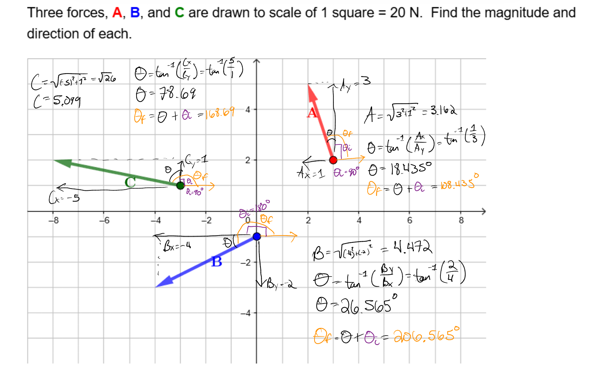

## Chapter 2
### Test 1

To solve the problem, the student needs to use the graph to find out the magnitude of each vector in the x and y directions, then use the pythagorean theorem to solve. We will store this as a force vector like normal, and have a list of three vectors. The following matrix which will be passed into the LLM. The first row is just data headers giving each force a number--in this case force1-->A, force2-->B, force3-->C in the diagram. This clarifies that the data below the name of the force are the components which define the force. The second row is the magnitude of the forces. The third row is the direction of the forces in degrees where 0 degrees follows the same direction as the positive x-axis. The fourth row is the x-coordinate of the force, and the fifth row is the y-coordinate of the force.

Edit: Now the second and third row contain the x and y components of the vector respectively. The rest has been shifted down so that in order of top to bottom it is, vector number -> magnitude -> x-component -> y-component -> direction -> x location, y location