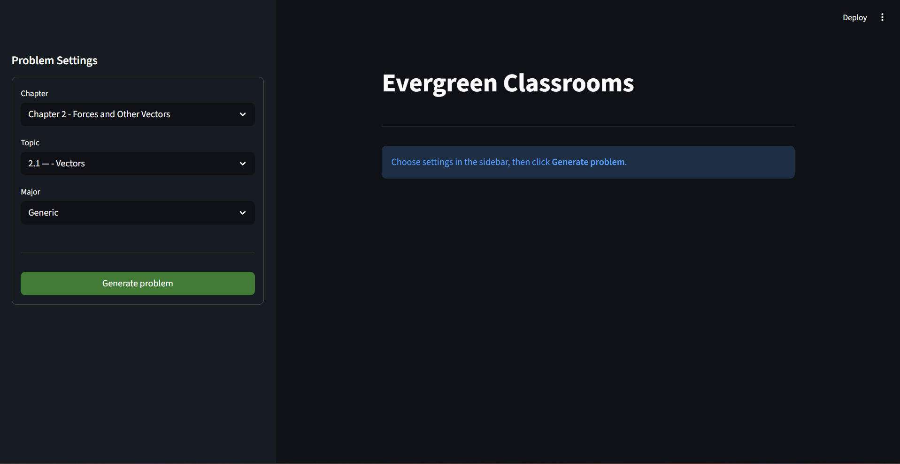
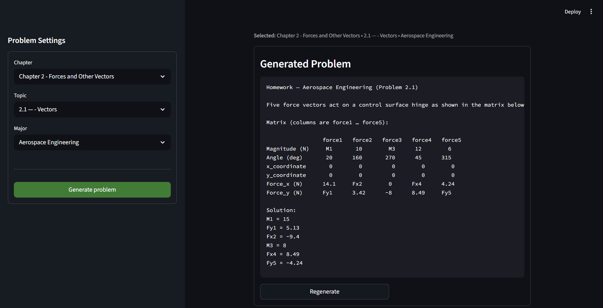

# Evergreen Classrooms User Guide

---

## Table of Contents

- [System Requirements](#system-requirements)
- [Installation Guide](#installation-guide)
- [Running the Application](#running-the-application)
- [Generating a Problem](#generating-a-problem)
- [File Structure](#file-structure)
- [Troubleshooting](#troubleshooting)
- [How to Use](#how-to-use)
- [FAQ](#FAQ)

---

## System Requirements

Minimum requirements:

- Python 3.11 or newer
- Internet connection
- OpenAI API key
- Web browser (Chrome, Edge, or Firefox)

Required Python packages:

- streamlit
- openai
- reportlab

---

## Installation Guide

### Step 1: Clone the Repository

Open a terminal and run:

```bash
git clone https://github.com/MicMe23/SeniorDesign.git
cd EvergreenClassrooms
```

### Step 2: install dependencies
```bash
pip install ./application/requirements.txt
```

### Step 3: Aquire OpenAI api key
1. make open ai account
2. load $5 onto balance in order to get access to your key
3. type key in search bar to find your key
4. copy key (do not share with anyone, this key is tied to your account)
5. open powershell 
```bash 
setx OPENAI_API_KEY "[your_api_key_here]"
```
6. close all running terminals. restart computer. Then in a new terminal run 
```bash
echo $env:OPENAI_API_KEY
```
If the above command gives an output, your key is properly linked.

### Step 4: Running the Application

1. open up the project and run 
```bash
streamlit run application/streamlit/app.py
```
2. If streamlit does not open immediately then go to the internet and put the following in the search bar
```bash
http://localhost:8501
```
you are now in the app if you see this page


### File Structure

```bash
EvergreenClassrooms/
├── application/
│   ├── streamlit/
│   │   └── app.py
│   ├── call_api.py
|   ├── requirements.txt
│
├── data/
│   └── chapter2/
│       ├── matrix1.csv
│       ├── matrix2.csv
│       └── ...
│
├── docs/
│   └── manual.md
│
└── README.md
```

### How to Use



Sidebar: select preferences for problem generation in the sidebar. Click "generate problem" when you would like to make a problem

Main page: After the problem is created, you will be able to view it in the container and copy and paste it's content with formatting.
If you want to regenerate a problem with the same constraints and numbers, click regenerate. 

### FAQ

#### Do i need an openAI Account?
Yes, make sure to create your account on https://openai.com/
Load up at least $5 on the billing tab and then you will hav full access to OpenAI's tools.
Grab your api key and follow the instructions above to set your key in your environmental variables 

#### My question will not generate, i get an error
your OpenAI api key is not set correctly. open up a fresh powershell terminal and run
```bash
echo $env:OPENAI_API_KEY
```
if this outputs a key you are good to go

#### Can I input my own context to OpenAI
we are creating a way for users to make their own custom constraints to give to the ai to adjust the question to their needs.